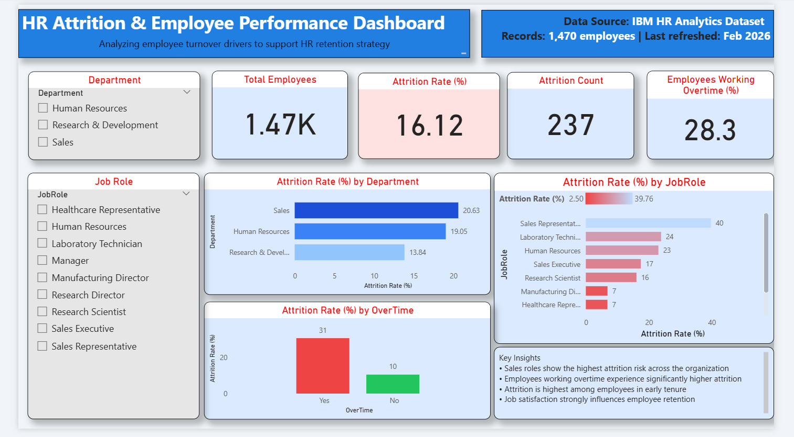

# HR Attrition & Employee Performance Analysis

## 📌 Problem Statement
Employee attrition impacts organizational productivity and increases hiring costs.  
This project analyzes key drivers of employee attrition to support data-driven HR retention strategies.

---

## 🛠 Tools & Technologies
- Python (Pandas, Matplotlib, Seaborn)
- SQL (SQLite)
- Power BI
- GitHub

---

## 📊 Key KPIs
- Total Employees
- Attrition Rate (%)
- Attrition Count
- Employees Working Overtime (%)

---

## 🔍 Analysis Performed
- Data cleaning and preprocessing using Python
- Exploratory Data Analysis (EDA)
- SQL-based analysis for aggregation and filtering
- Interactive Power BI dashboard for business insights

---

## 💡 Key Insights
- Sales roles show the highest attrition risk across the organization
- Employees working overtime experience significantly higher attrition
- Attrition is highest among employees in early tenure
- Job satisfaction strongly influences employee retention

---

## 📈 Dashboard Preview

---

## 📁 Project Structure
HR-Analytics-Attrition-Performance/
│
├── data/
│   └── cleaned_hr_attrition.csv
│
├── notebooks/
│   └── hr_attrition_analysis.py
│
├── sql/
│   └── hr_attrition_queries.sql
│
├── powerbi/
│   └── HR_Attrition_Dashboard.pbix   👈 THIS FILE
│
├── images/
│   └── dashboard.png
│
└── README.md

---

## 📎 Data Source
IBM HR Analytics Employee Attrition Dataset

---

## 🚀 Outcome
This project demonstrates an end-to-end HR analytics workflow combining Python, SQL, and Power BI to deliver actionable business insights.

## 🌐 Dashboard Access
Due to Power BI Service account restrictions, the dashboard is shared as a `.pbix` file.

To view the dashboard:
1. Download `HR_Attrition_Dashboard.pbix`
2. Open it using Power BI Desktop
3. Interact with slicers and visuals to explore insights

A dashboard preview image is included above for quick reference.
